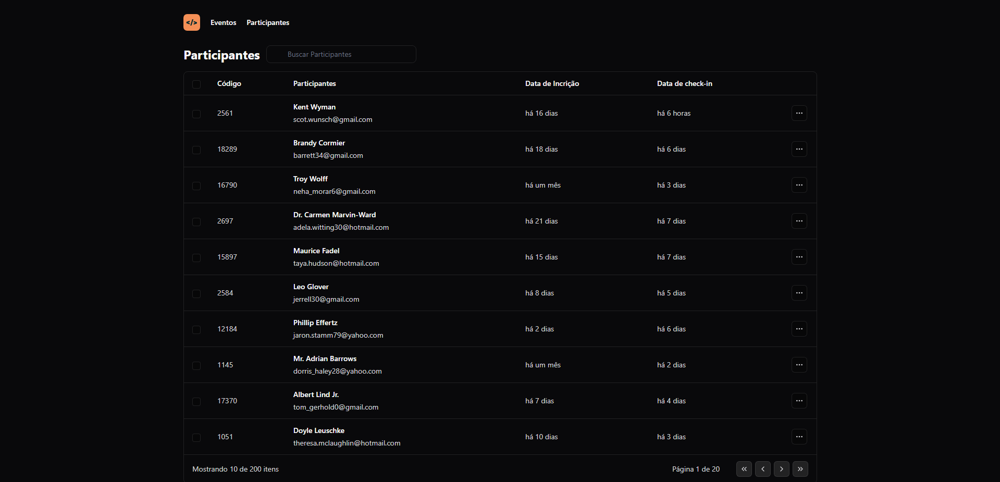

# 🖥️ Lista de Atendimento 

Projeto feito com uma tipagem utilizando Typescript, tooling com Vite, interface responsiva com TaiwindCS.

## ⚙️ Pré-requisitos

```
npm install -D tailwindcss postcss autoprefixer

npm install @faker-js/faker --save-dev

npm i dayjs
```
## 📦 Tecnologias usadas:

**Front-end:**
* [React JS](https://react.dev/)
* [TailwindCSS](https://tailwindcss.com/)

**Back-end:**
* [Dados fictícios utilizando a biblioteca Fakerjs][https://fakerjs.dev/]
